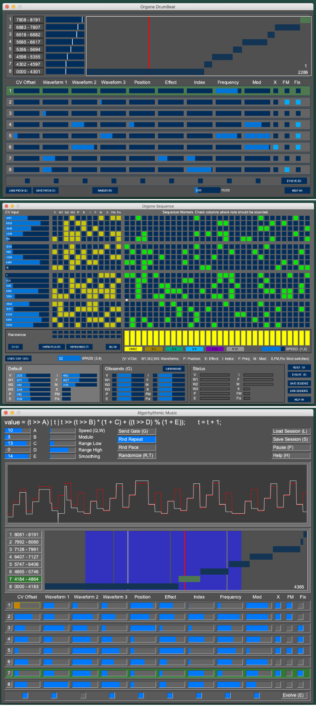

#Remote Control Organ Accumulator

Three Projects:

1. OAPacket
   OA (Orgone Accumulator) firmware.
   You must download this to the OA to use the Remote Control apps.

   When you want to return to the stock firmware, visit:
   https://github.com/jakplugg/Orgone-accumulator

2. OrgoneDrumbeat.  Processing app to remote control the OA.
    Drum Beat Sound Controller for the OA.
    Eight Bands are provided, each with a bank of controls for the OA parameters.
    Which Band is heard is controlled by the CV input voltage of the OA.

3. OrgoneSequence.  Processing app to remote control the OA.
    20 Channel, 32 step sequencer for the OA.

--------------------------------
Download and Install Arduino environment, upload firmware to OA:
1. downloaded Arduino:  https://www.arduino.cc/en/Main/Software
   confirm it runs okay
2. download TeensyDuino:  https://www.pjrc.com/teensy/td_download.html
3. launch Arduino, load OAPacket code (click on OAPacket.ino)
4. Set <Tools><Boards Manager> to "Teensy 3.2/3.1"
5. Set <Tools><CPU Speed> to "120 MHz (overclock)". **
6. did 'Verify", then "Upload"
7. Finished with Arduino.

video help: https://www.patreon.com/posts/neutron-sound-1554012

** the Teensy can be overclocked to 144 MHz.
Visit:   http://neutron-sound.com/PDFs/NOA_build_manual.pdf,  Page 40

--------------------------------
Download Processing: https://processing.org/download/ (Windows, Linux, Mac)
Processing requires the controlP5 add-on library:
  1. select Menu option <Sketch><Import Library><Add Library...>
  2. type ControlP5 into edit field to narrow the search
  3. select and install ControlP5 by Andreas Schiegel

